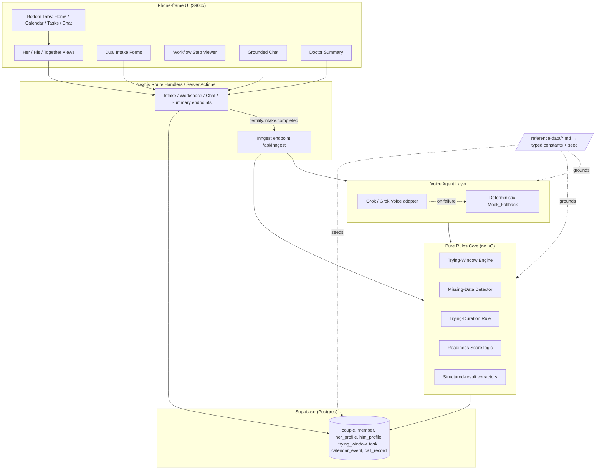
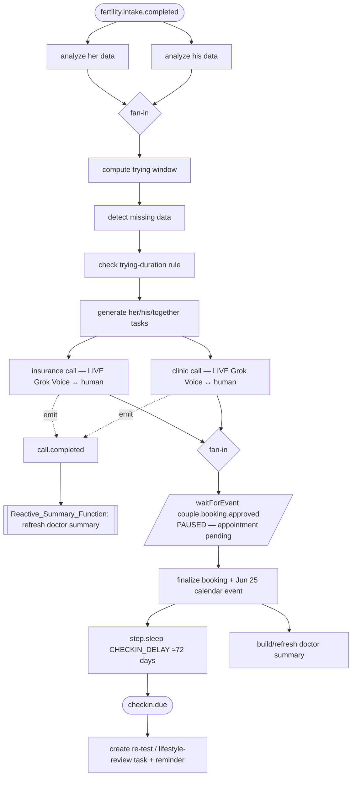
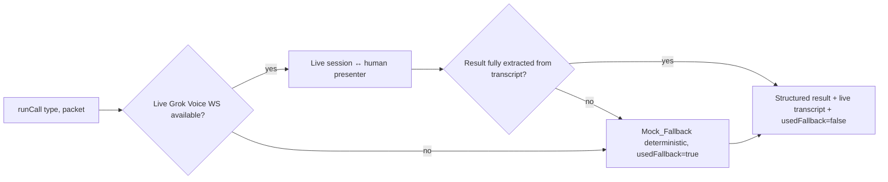

# Design Document

## Overview

Fairy is a mobile-first web application that treats fertility preparation as a shared, two-partner workflow for straight couples in the US trying to conceive. Beyond a tracker, it adds an autonomous agent that handles the phone-and-paperwork grind: it runs simulated insurance and clinic calls, extracts structured results, and turns them into calendar events and tasks. The product theme is **patient agency**.

This design realizes all 16 requirements with an architecture built for a one-day hackathon by two people working in parallel: a clean separation between a **pure rules core** (deterministic, heavily testable) and an **orchestration + UI shell** (Inngest, Grok, Supabase, Next.js). The pure core — the Trying-Window engine, Missing-Data detector, Readiness-Score logic, Trying-Duration rule, and the structured-result extractors — is where correctness lives and where property-based testing pays off. Everything clinical is grounded in `/reference-data/`; nothing medical is invented.

### Design Principles

1. **Reference data is the source of truth** (Req 12). Every clinical value, range, code, term, and line of dialogue traces to a `/reference-data/` file. The seed couple "Maya & Daniel" (`sample-couple.md`) is the only couple in the system. We encode reference values as typed constants and seed fixtures, never as free-floating literals scattered through UI code.
2. **Pure core, impure shell.** The fertility math, detectors, scoring, and extraction are pure functions with no I/O. They are imported identically by the Inngest workflow (server) and, where useful, by the UI. This makes the deterministic Mock_Fallback trivial and the property tests meaningful.
3. **Live-first, deterministic safety net** (Req 6.2, 6.7, 15.5, 16.3). The Voice_Agent holds a real spoken conversation with a live human over the Grok Voice WebSocket; results come from that real transcript. A deterministic Mock_Fallback returning identical schema and values for identical inputs engages ONLY if the live session is unavailable or fails, so the sub-three-minute demo never stalls.
4. **Impeccable everywhere** (Req 13). All UI is produced through the Impeccable skill at `.kiro/skills/impeccable/`, presented as a 390px phone app with bottom tab navigation, app-like cards, and sticky headers. A `critique.md` pass gates every screen.
5. **Calm, not cluttered** (Req 14). Exactly one footer disclaimer line; no synthetic-data badges or warnings in main views.

### Technology Stack (Req 15)

| Concern | Choice |
| --- | --- |
| Framework | Next.js (App Router), TypeScript |
| Styling / components | Tailwind CSS, shadcn/ui, governed by the Impeccable skill |
| Reasoning | xAI Grok (chat/structured reasoning) |
| Live calls | Grok Voice Agent API over a WebSocket (`XAI_VOICE_WS_URL`, `XAI_VOICE_MODEL`) — a real spoken conversation with a live human; deterministic Mock_Fallback as a safety net only |
| Orchestration | Inngest (event-driven graph: fan-out/fan-in, `waitForEvent` approval gate, `step.sleep` scheduled check-in, a separate reactive function) |
| Data | Supabase (Postgres) |
| Deployment | Vercel; runs locally |
| Secrets | `XAI_API_KEY` from `.env.local`, falling back to `GROK_API_KEY`; `XAI_VOICE_WS_URL` / `XAI_VOICE_MODEL` for the voice path; `CHECKIN_DELAY` for the demoable scheduled check-in |
| Excluded | Twilio, real telephony, real PHI |

## Architecture

### High-Level Architecture

Fairy is a single Next.js application. The browser renders the phone-frame UI and talks to the app's own route handlers. Route handlers read/write Supabase and emit/consume Inngest events. The Inngest workflow drives the agent and the pure rules core. Grok and Grok Voice sit behind an adapter that always has a Mock_Fallback.



### The Event-Driven Inngest Graph (Req 7, 17, 18, 19)

The workflow is the spine of the demo. It is triggered exactly once by `fertility.intake.completed` (Req 2.6) and runs as an event-driven graph rather than a single linear function: parallel fan-out/fan-in branches, a `waitForEvent` human-approval pause, a `step.sleep` scheduled check-in, and a separate reactive function. Each step persists a status (`pending | running | completed | failed | paused`) the UI polls/streams so the orchestration — including concurrency and the pause — is visible and credible.

**Workflow_Events** drive the graph:
- `fertility.intake.completed` — start (Req 2.6, 7.1)
- `call.completed` — emitted per completed call; consumed by the reactive summary function (Req 7.7, 19)
- `couple.booking.approved` — resumes the paused approval gate (Req 17.3)
- `checkin.due` — the scheduled wake for the male check-in (Req 18.3)



**Fan-out / fan-in** (Req 7.1, 7.8). `analyze her data` and `analyze his data` run as two concurrent `step.run` blocks that both complete before `compute trying window` starts. Likewise the `insurance call` and `clinic call` run as two parallel branches that both complete before the approval gate is entered. The `WorkflowViewer` renders these as parallel tracks, not a single line.

**Booking approval gate** (Req 17). After both calls complete, the workflow sets the booking step `paused` and calls `waitForEvent("couple.booking.approved", { timeout })` while the appointment stays `pending`. The app shows the `Booking_Approval_Card`; when the couple approves, the app emits `couple.booking.approved` and the **same** run resumes from the gate and finalizes the booking, the Jun 25 calendar event, and the summary — finalizing at most one booking (no double-book). If the timeout expires, the appointment stays pending and a "needs approval" state is surfaced.

**Scheduled check-in** (Req 18). After finalizing, the workflow schedules a delayed check-in with `step.sleep`/`sleepUntil` over the ≈72-day sperm-regeneration horizon. The delay is read from `CHECKIN_DELAY` so it can be set to seconds on stage while the UI copy reads "~10–12 weeks." On wake (`checkin.due`) it creates a "re-test semen analysis / review lifestyle progress" task and a reminder.

**Reactive summary** (Req 19). A separate Inngest function listens for `call.completed` and refreshes the `Doctor_Summary` from the latest persisted call results, decoupled from the main run.

If a step fails, the workflow marks it `failed`, halts the steps that depend on it, and surfaces an error identifying the failed step (Req 7.3).

### Voice Agent Resolution Strategy (Req 6, 15.5)

The agent layer exposes one interface (`runInsuranceCall`, `runClinicCall`). Internally it opens a **live Grok Voice WebSocket session** (`XAI_VOICE_WS_URL` / `XAI_VOICE_MODEL`) and conducts a real spoken conversation with a **live human** — during the demo, the presenter plays the insurance rep and the clinic scheduler. There is no second Grok and no scripted bot responder. The agent is given the couple's data + missing-data flags and reasons about which `Call_Objectives` (the 10 insurance / 7 clinic items in `call-scripts.md`) to cover for this couple: it phrases its own questions, asks follow-ups based on what the human says, skips already-answered objectives, and digs deeper on vague answers. It then extracts the structured result from the **actual live transcript**, mapping it to the `call-scripts.md` schemas regardless of the order or wording of the human's answers. `insurance-coverage-data.md` and `clinic-intake-data.md` are a cue sheet for the human (deductible $1,500, in-network lab "Crest Diagnostics", Jun 25 slot, etc.), not a script for a bot.

On unavailability or failure (no key, no mic, bad network, mid-call error, or incomplete extraction), the agent falls through to the deterministic **Mock_Fallback** — a safety net only. Because the Mock_Fallback is a pure function of (call type, authorization packet), identical inputs always yield identical schema and values (Req 6.7). The `Call_Console` UI shows a `LIVE` vs `FALLBACK` indicator so which path produced the result is always visible.



### Module / Directory Layout

```
app/
  (tabs)/
    home/        # Her / His / Together views + workflow viewer
    calendar/    # Shared calendar
    tasks/       # Task delegation board
    chat/        # Grounded chat
  intake/        # Dual intake forms (her / him / together)
  summary/       # Doctor-ready summary
  api/
    inngest/     # Inngest serve endpoint
    chat/        # Grounded chat endpoint (Grok + Mock_Fallback)
    summary/     # Summary build endpoint
lib/
  core/          # PURE: trying-window, missing-data, duration, score, extract
  reference/     # Typed constants derived from /reference-data/ (WHO limits, ranges, scripts)
  agent/         # Grok/Grok Voice adapter + Mock_Fallback
  inngest/       # client + the 7-step function
  db/            # Supabase client, queries, seed
  validation/    # Zod schemas for intake fields (ranges from reference)
components/
  ui/            # shadcn/ui primitives (Impeccable-styled)
  fairy/         # PhoneFrame, BottomTabs, StickyHeader, cards, etc.
supabase/
  migrations/    # schema
  seed/          # Maya & Daniel seed from sample-couple.md
```

## Components and Interfaces

### Reference Constants Layer (`lib/reference/`) — Req 12

A typed, single-source module that encodes the reference data so no clinical literal lives elsewhere. Examples grounded directly in the reference files:

```ts
// WHO 2021 lower reference limits — semen-analysis-reference.md
export const WHO_2021 = {
  semenVolumeMl: 1.4,
  concentrationMillionMl: 16,
  totalSpermMillion: 39,
  totalMotilityPct: 42,
  progressiveMotilityPct: 30,
  vitalityPct: 54,
  normalMorphologyPct: 4,
  phMin: 7.2,
} as const;

// female-hormone-reference.md (day-3 windows, mid-luteal progesterone target)
export const FEMALE_HORMONE = {
  day3FshDrawWindow: "cycle day 2–3",
  ovulationIndicativeProgesteroneNgMl: 10,
} as const;

// cycle-fertility-reference.md
export const DURATION_RULE = { under35Months: 12, atLeast35Months: 6, ageThreshold: 35 } as const;

// CPT codes referenced by the agent and summary — cpt-codes-fertility.md
export const CPT = { semenAnalysis: "89320", fsh: "83001", estradiol: "82670",
  progesterone: "84144", tsh: "84443", prolactin: "84146", iui: "58322", ivf: "58970" } as const;
```

The seed couple, call scripts, mock rep/clinic responses, and clinic slots are likewise encoded as fixtures sourced verbatim from `sample-couple.md`, `call-scripts.md`, `insurance-coverage-data.md`, and `clinic-intake-data.md`.

### Trying-Window Engine (`lib/core/trying-window.ts`) — Req 3

Pure function implementing the irregular-cycle algorithm from `cycle-fertility-reference.md`. Uses only the female partner's inputs (Req 3.6); male data is not in the signature at all.

```ts
interface TryingWindowInput {
  lastPeriodStart: string;   // ISO date
  cycleLengthMin: number;    // days
  cycleLengthMax: number;    // days
  ovulationConfirmed: boolean; // mid-luteal progesterone OR LH confirmation present
}
interface TryingWindowOutput {
  fertileWindowStart: string; // ISO date
  fertileWindowEnd: string;
  minOvulation: string;       // priority day start
  maxOvulation: string;       // priority day end
  confidence: "Low" | "Moderate" | "High";
  reasons: string[];          // e.g. ["irregular cycle","ovulation not confirmed","wide cycle range"]
}
function computeTryingWindow(input: TryingWindowInput): TryingWindowOutput
```

Math (all date arithmetic in days):
- `minOvulation = lastPeriodStart + cycleLengthMin − 14`
- `maxOvulation = lastPeriodStart + cycleLengthMax − 14`
- `fertileWindowStart = minOvulation − 5`
- `fertileWindowEnd = maxOvulation + 1`

Confidence is `Low` with reasons `["irregular cycle","ovulation not confirmed","wide cycle range"]` when ovulation is unconfirmed AND `cycleLengthMax − cycleLengthMin > 7` (Req 3.5). For the seed couple (`2026-06-01`, 45, 60) this yields fertile window **Jun 27 – Jul 18, 2026**, priority **Jul 2 – Jul 17, 2026**, confidence **Low** (Req 3.2–3.4). Missing/invalid required input throws a typed error and preserves prior state (Req 3.7).

### Missing-Data Detector (`lib/core/missing-data.ts`) — Req 4

Pure function over female labs, semen results, and coverage status. Produces a consolidated checklist of flagged items with grounded explanations.

```ts
type FlagKind = "missing" | "borderline" | "unverified";
interface DataFlag {
  id: string;            // e.g. "day3_fsh", "concentration", "insurance_coverage"
  kind: FlagKind;
  label: string;
  explanation: string;   // grounded text citing the reference file
  source: string;        // reference file name
}
function detectMissingData(input: MissingDataInput): DataFlag[]
```

Rules (all grounded):
- `day3_fsh` / `day3_estradiol` null → `missing`, explanation: drawn on cycle day 2–3 for ovarian-reserve assessment (`female-hormone-reference.md`) (Req 4.2).
- `mid_luteal_progesterone` null → `missing`, ovulation can't be confirmed without a mid-luteal progesterone rise toward ≈10 ng/mL (Req 4.3).
- `prolactin` null → `missing`, part of the pituitary/ovulation screen (Req 4.4).
- Any semen parameter below its WHO 2021 limit → `borderline`, recommend one repeat analysis after 2–7 days abstinence (Req 4.5).
- `coverage_status != "confirmed"` → `unverified`, verification required before care (Req 4.6).

### Trying-Duration Rule (`lib/core/duration-rule.ts`) — Req 7.4–7.6

```ts
interface DurationInput { femaleAge: number; monthsTrying: number; redFlags: string[]; }
interface DurationResult { thresholdMonths: 6 | 12; recommendEarlyEvaluation: boolean; redFlags: string[]; }
```

`femaleAge < 35 → 12`, else `6` (Req 7.4). Any red flag (irregular/absent periods, known PCOS/endometriosis, prior pelvic surgery, known male factor) forces early-evaluation regardless of threshold (Req 7.5). Seed couple: age 33 → 12-month threshold, 8 months trying, early evaluation due to irregular cycles + borderline semen analysis (Req 7.6).

### Readiness-Score Logic (`lib/core/readiness.ts`) — Req 1.4, 5.4

```ts
function applyTaskCompletion(score: number, taskWeight: number): number // clamps to [0,100]
```

Completing a male-track task increases the score; the result is always clamped to `[0,100]` inclusive. Seed starting value 62 (`sample-couple.md`).

### Structured-Result Extractors (`lib/core/extract.ts`) — Req 6.2–6.5

Two extractors map a call transcript (or mock responses) to the exact schemas in `call-scripts.md`:

```ts
interface InsuranceResult {
  diagnostic_covered: boolean; semen_analysis_covered: boolean; hormone_labs_covered: boolean;
  prior_auth_required_for: string[]; in_network_lab: string; deductible: number;
  coinsurance_pct: number; oop_max: number; referral_required: boolean; follow_up_tasks: string[];
}
interface ClinicResult {
  booked: { date: string; time: string; mode: string; clinic: string };
  bring_list: string[];
  tasks: { her: string[]; him: string[]; together: string[] };
  calendar_event: { type: string; date: string; time: string };
}
```

Any field that cannot be extracted is marked unresolved, a follow-up task is added, and all other fields are preserved (Req 6.5). A request for a medical decision is declined and converted to a follow-up task (Req 6.9). Member ID / DOB are withheld until the responder requests identity verification (Req 6.8).

### Voice Agent + Mock_Fallback (`lib/agent/`) — Req 6, 15.5

```ts
interface CallOutput<T> { transcript: Turn[]; result: T; usedFallback: boolean; }
function runInsuranceCall(packet: AuthPacket): Promise<CallOutput<InsuranceResult>>
function runClinicCall(packet: AuthPacket): Promise<CallOutput<ClinicResult>>
```

The agent opens a live Grok Voice WebSocket session and covers the 10 insurance / 7 clinic `Call_Objectives` adaptively (phrasing its own questions, following up, skipping answered items) rather than reading a fixed script (Req 6.2, 6.3). It extracts the structured result from the real human transcript in any answer order/wording (Req 6.4, 6.5). The Mock_Fallback engages only on live failure, returns the deterministic mock results from `call-scripts.md`, and is a pure function of inputs (Req 6.7); `usedFallback` records which path produced the result so the `Call_Console` can show LIVE vs FALLBACK. On clinic completion the agent writes back her/his/together tasks, a `2026-06-25` calendar event, and a summary of coverage facts + appointment + bring-list (Req 6.6).

### UI Components (`components/fairy/`) — Req 1, 13

All built via the Impeccable skill. `PhoneFrame` enforces the 390px mobile frame; `BottomTabs` provides Home / Calendar / Tasks / Chat; `StickyHeader` per screen; app-like cards used only where they are the best affordance (per Impeccable's "cards are the lazy answer" guidance). A single `DisclaimerFooter` renders exactly one line (Req 14).

- **WorkspaceTabs**: Her / His / Together segmented control; each view loads its scoped data within the required latency budgets (Req 1.3–1.5). `MISSING` values render as missing-data flags, never blanks or substitutes (Req 1.8).
- **IntakeForm**: structured fields only (Req 2.1), Zod-validated against reference ranges; invalid entries are rejected, prior value retained, error names the field + expected range (Req 2.8).
- **WorkflowViewer**: renders the event-driven graph with `pending/running/completed/failed/paused` chips, drawing concurrent fan-out branches (analyze her/his; insurance/clinic calls) as parallel tracks rather than a single line, and rendering the booking step as `paused` while it waits at the approval gate (Req 7.2, 20.4, 20.5).
- **CallConsole**: the live call surface (Req 6.10, 20.1–20.3) — a chronological live transcript of agent/human turns appended as they occur, a `LIVE` vs `FALLBACK` indicator bound to `usedFallback`, and the structured result fields filling in progressively as the agent extracts them.
- **BookingApprovalCard**: shown while the workflow is paused at the gate (Req 17.2, 17.3) — states that the agent verified coverage and found the Jun 25 slot, and on Approve emits `couple.booking.approved` (via an injectable emitter seam) so the same run resumes; shows a "needs approval" state on gate timeout (Req 17.5).
- **TaskBoard**: three columns Her / His / Together (Req 5.1).
- **CalendarView**: window, priority days, reminders, consult, tasks (Req 10).
- **DoctorSummary**: sectioned, single copy-to-clipboard action (Req 8.2); refreshes when the reactive summary function updates it (Req 19.3).
- **GroundedChat**: fixed five-section answer format (Req 9.2).

### Grounded Chat (`app/api/chat/`) — Req 9

Answers are constrained to the single seed couple `couple_001`. The endpoint builds a Grok prompt from the couple's persisted data + reference sources and enforces the fixed output order: **Short answer → Based on your data → What's uncertain → Shared next step → Sources**, every section present and non-empty (Req 9.2). If a requested fact is absent from Reference_Data, the answer states it is unavailable and offers no substitute (Req 9.4). A Mock_Fallback supplies deterministic structured answers for the five canonical questions when Grok is unavailable.

### Doctor Summary (`app/api/summary/`) — Req 8

Assembles both partners' data, the Trying-Window output, Missing-Data flags, doctor questions, verified coverage facts, and the booked June 25 consult. Clinical statements are restricted to Reference_Data sources; anything not present is omitted (Req 8.3–8.4). Coverage is labeled `unverified` while `coverage_status = partial_unconfirmed` (Req 8.5); appointment shows `pending` if not booked (Req 8.6).

## Data Models

### Supabase Schema (Req 11)

Eight entities, seeded from `sample-couple.md`. Clinical values stored exactly as defined in Reference_Data; `null` represents `MISSING` so the detector and UI can flag it.

```mermaid
erDiagram
    couple ||--o{ member : has
    couple ||--|| her_profile : has
    couple ||--|| him_profile : has
    couple ||--o{ trying_window : has
    couple ||--o{ task : has
    couple ||--o{ calendar_event : has
    couple ||--o{ call_record : has

    couple {
      text id PK
      text display_name
      int trying_since_months
      text goal
      text top_concern
      text insurance_provider
      text plan_type
      text member_id
      text group_number
      text policy_holder
      text coverage_status
    }
    member {
      uuid id PK
      text couple_id FK
      text role
      text name
      int age
      date dob
    }
    her_profile {
      text couple_id FK
      date last_period_start
      int avg_cycle_length
      int cycle_length_min
      int cycle_length_max
      bool cycle_regular
      int months_trying
      jsonb conditions
      jsonb prior_meds
      text ovulation_tracking
      int prior_pregnancies
      numeric amh
      numeric tsh
      numeric day3_fsh
      numeric day3_estradiol
      numeric mid_luteal_progesterone
      numeric prolactin
    }
    him_profile {
      text couple_id FK
      text semen_analysis_status
      date semen_analysis_date
      numeric volume_ml
      numeric concentration_million_ml
      numeric total_count_million
      numeric progressive_motility_pct
      numeric total_motility_pct
      numeric morphology_normal_pct
      numeric vitality_pct
      numeric ph
      jsonb lifestyle
      jsonb medical_history
      int readiness_score
    }
    trying_window {
      uuid id PK
      text couple_id FK
      date fertile_window_start
      date fertile_window_end
      date min_ovulation
      date max_ovulation
      text confidence
      jsonb reasons
    }
    task {
      uuid id PK
      text couple_id FK
      text column
      text title
      bool completed
      int weight
      text source_call_record_id FK
    }
    calendar_event {
      uuid id PK
      text couple_id FK
      text type
      text title
      date date
      text time
      text description
    }
    call_record {
      uuid id PK
      text couple_id FK
      text call_type
      jsonb transcript
      jsonb extracted_result
      bool used_fallback
      jsonb unresolved_fields
    }
}
```

### Seed Data (Req 11.2–11.3)

The seed loader writes Maya & Daniel exactly as in `sample-couple.md`: couple `couple_001`, `coverage_status: partial_unconfirmed`; Maya age 33, `last_period_start 2026-06-01`, cycle 45–60, `cycle_regular false`, 8 months trying, suspected PCOS, letrozole history, labs with `day3_fsh / day3_estradiol / mid_luteal_progesterone / prolactin = null` (MISSING) and `amh 1.6`, `tsh 2.1`; Daniel age 35, semen completed `2026-05-20` with concentration 14, total count 29, progressive motility 28, morphology 3 (all below WHO), lifestyle heat exposure true / stress high / BMI 27, readiness 62. If seed data is missing or unparseable, the workspace refuses to render partially and shows a load error (Req 1.7).

### Validation Schemas (`lib/validation/`) — Req 2

Zod schemas enforce reference-grounded bounds: Her `avg_cycle_length` within stated range, enumerations for `semen_analysis_status` (`not_started | in_progress | completed`), `policy_holder` (`her | him`), `coverage_known` (`confirmed | partial_unconfirmed | unconfirmed`), and semen values validated against WHO 2021 limits. Field names mirror `sample-couple.md` exactly (Req 2.5). On both intakes valid, the system emits `fertility.intake.completed` exactly once (Req 2.6).

## Correctness Properties

*A property is a characteristic or behavior that should hold true across all valid executions of a system — essentially, a formal statement about what the system should do. Properties serve as the bridge between human-readable specifications and machine-verifiable correctness guarantees.*

These properties target the pure rules core and grounding logic, where behavior varies meaningfully with input and many generated cases reveal edge bugs. UI structure, latency budgets, deployment/config, and design-process requirements are validated by example, integration, and smoke tests instead (see Testing Strategy).

### Property 1: Trying-window algebraic relationships

*For any* valid female input (`lastPeriodStart`, `cycleLengthMin ≤ cycleLengthMax`), the engine output satisfies `minOvulation = lastPeriodStart + cycleLengthMin − 14`, `maxOvulation = lastPeriodStart + cycleLengthMax − 14`, `fertileWindowStart = minOvulation − 5`, and `fertileWindowEnd = maxOvulation + 1`, as calendar dates.

**Validates: Requirements 3.1**

### Property 2: Low-confidence reasons when unconfirmed and wide

*For any* input where ovulation is not confirmed AND `cycleLengthMax − cycleLengthMin > 7`, the engine outputs confidence exactly `"Low"` and reasons exactly `["irregular cycle", "ovulation not confirmed", "wide cycle range"]`.

**Validates: Requirements 3.4, 3.5**

### Property 3: Ovulation timing ignores male data

*For any* fixed female input and *any* male partner data, the trying-window output is identical regardless of the male data (male data never changes ovulation timing).

**Validates: Requirements 3.6**

### Property 4: Trying-window rejects invalid required input

*For any* input missing or invalidating a required field (`lastPeriodStart`, `cycleLengthMin`, `cycleLengthMax`), the engine raises a typed error and the prior state is preserved.

**Validates: Requirements 3.7**

### Property 5: Missing labs are flagged with grounded explanations

*For any* female lab set, each of `day3_fsh`, `day3_estradiol`, `mid_luteal_progesterone`, and `prolactin` is flagged `missing` with a non-empty grounded explanation if and only if its value is null.

**Validates: Requirements 4.2, 4.3, 4.4**

### Property 6: Semen parameters flagged borderline iff below WHO 2021 limit

*For any* semen analysis result, each parameter is flagged `borderline` (with a repeat-analysis-after-2–7-days-abstinence recommendation) if and only if its value is below its WHO 2021 lower reference limit.

**Validates: Requirements 4.5**

### Property 7: Insurance flagged unverified iff not confirmed

*For any* coverage status value, insurance coverage is flagged `unverified` if and only if the status is not equal to `"confirmed"`.

**Validates: Requirements 4.6**

### Property 8: Checklist completeness

*For any* detector input, the consolidated checklist contains exactly the set of flags produced by the rules — every flagged missing item and every flagged borderline item appears exactly once, each with a non-empty explanation, and no unflagged item appears.

**Validates: Requirements 4.1, 4.7**

### Property 9: Readiness score stays an integer within [0, 100]

*For any* starting score in [0, 100] and *any* sequence of male-track task completions with arbitrary weights, the resulting Readiness_Score is an integer, never decreases on a completion, and remains within [0, 100] inclusive.

**Validates: Requirements 1.4, 5.4**

### Property 10: Every task is assigned to exactly one column

*For any* extracted call result, each follow-up task created is assigned to exactly one of the columns Her, His, or Together (never zero, never more than one).

**Validates: Requirements 5.2, 5.5**

### Property 11: Intake validation rejects out-of-range values

*For any* clinical field with a reference range and *any* value outside that range, the intake rejects the value, retains the prior value, and produces an error that names the field and its expected range; *for any* in-range value, the intake accepts it.

**Validates: Requirements 2.7, 2.8**

### Property 12: Intake completion event fires exactly once

*For any* sequence of intake updates, `fertility.intake.completed` is emitted exactly once and only after both partners' intakes are complete and valid (never before, never twice).

**Validates: Requirements 2.6**

### Property 13: Duration threshold by age

*For any* female age, the trying-duration threshold is 12 months if age < 35 and 6 months if age ≥ 35.

**Validates: Requirements 7.4**

### Property 14: Red flags force early evaluation

*For any* duration input containing at least one red-flag condition, early evaluation is recommended regardless of months trying or the age-based threshold.

**Validates: Requirements 7.5**

### Property 15: Call output conforms to its schema

*For any* completed call (live or Mock_Fallback) and *any* responder variation, the output contains a chronological agent/responder transcript and an extracted result conforming to that call type's schema.

**Validates: Requirements 6.4**

### Property 16: Unresolved fields are isolated

*For any* set of fields that cannot be extracted from a call, each such field is marked unresolved with a corresponding follow-up task, and every successfully extracted field is preserved unchanged.

**Validates: Requirements 6.5**

### Property 17: Mock_Fallback is deterministic

*For any* call type and authorization packet, repeated Mock_Fallback runs with identical inputs return identical schema and identical field values.

**Validates: Requirements 6.7, 15.5, 16.3**

### Property 18: Identity details withheld until verification requested

*For any* call conversation, the member ID and date of birth are disclosed only after the responder requests identity verification, and never before.

**Validates: Requirements 6.8**

### Property 19: Medical-decision requests are declined

*For any* responder turn requesting a medical decision or acceptance of treatment, the agent declines and adds a follow-up task for the couple, and never accepts on their behalf.

**Validates: Requirements 6.9**

### Property 20: Persistence round-trip preserves values

*For any* profile or call record object, serializing then deserializing (and writing then reading from the data layer) preserves all field values exactly, including null `MISSING` values.

**Validates: Requirements 11.3**

### Property 21: Summary and chat are grounded in Reference_Data

*For any* couple data, every clinical value and citation appearing in the doctor summary or a chat answer traces to a source within Reference_Data; any value absent from Reference_Data is omitted (summary) or reported as unavailable with no substitute (chat).

**Validates: Requirements 8.3, 8.4, 9.4, 12.1, 12.3**

### Property 22: Chat answers use the fixed five-section format

*For any* question, the grounded-chat answer contains the five sections — Short answer, Based on your data, What's uncertain, Shared next step, Sources — in that exact order, each present and non-empty.

**Validates: Requirements 9.2**

### Property 23: Chat is scoped to the seed couple

*For any* question, every source cited in the answer references the single seed couple `couple_001` / Reference_Data, and no other couple's data appears.

**Validates: Requirements 9.3**

### Property 24: MISSING values render as flags

*For any* profile with an arbitrary subset of fields set to `MISSING` (null), each such field renders as a missing-data flag, never as a blank field and never as a substituted value.

**Validates: Requirements 1.8**

### Property 25: Calendar dates equal engine output

*For any* Trying_Window_Engine output, the calendar's displayed trying-window and priority-day dates equal that output exactly, and after the engine updates, the displayed dates match the new output.

**Validates: Requirements 10.3, 10.4**

### Property 26: Single disclaimer, no synthetic-data clutter

*For any* rendered screen, exactly one disclaimer line with the exact text "Fairy provides educational fertility information, not medical advice." appears, and no synthetic-data badge or warning appears in the main views.

**Validates: Requirements 14.1, 14.2**

### Property 27: Live call result is parsed from the actual human transcript

*For any* live call transcript of human turns (in any order or wording that covers the objectives), the Voice_Agent's extracted structured result is derived from that transcript and conforms to the call-type schema; reordering or rewording answers that carry the same facts yields the same structured field values.

**Validates: Requirements 6.4, 6.5**

### Property 28: Mock_Fallback engages only on live failure and is deterministic

*For any* call, the Mock_Fallback result is used if and only if the live Grok Voice session is unavailable or fails (or extraction is incomplete); when used, repeated runs with identical inputs return identical schema and identical field values, and the output's `usedFallback` flag is `true` exactly when the fallback produced the result.

**Validates: Requirements 6.7, 15.5, 16.3**

### Property 29: Booking approval resumes the same run without double-booking

*For any* workflow run paused at the Booking_Approval_Gate, receiving a single `couple.booking.approved` event resumes that same run and finalizes exactly one booking and one Jun 25 calendar event; replaying or re-delivering the approval never produces a second booking.

**Validates: Requirements 17.3, 17.4**

### Property 30: Appointment stays pending until approval (or timeout)

*For any* workflow state before a `couple.booking.approved` event is received, the appointment status is `pending` and the booking step is `paused`; if the gate's wait window expires first, the appointment remains `pending` and a "needs approval" state is surfaced rather than a booking.

**Validates: Requirements 17.1, 17.5**

### Property 31: Reactive summary fires on every call.completed

*For any* sequence of completed calls, the Reactive_Summary_Function runs once per `call.completed` event and the refreshed Doctor_Summary reflects the latest persisted call results.

**Validates: Requirements 7.7, 19.2, 19.3**

### Property 32: Parallel branches join before the workflow proceeds

*For any* run, the two analyze branches (her, his) both reach `completed` before `compute trying window` starts, and the two call branches (insurance, clinic) both reach `completed` before the Booking_Approval_Gate is entered.

**Validates: Requirements 7.1, 7.8**

## Error Handling

The system distinguishes recoverable input/validation errors (handled inline in the UI, prior state preserved) from workflow/agent failures (surfaced in the workflow viewer) and demo-continuity failures (handled by Mock_Fallback).

### Intake and Engine Input Errors
- **Out-of-range intake values** (Req 2.8): rejected at the Zod boundary; the field retains its prior value and an inline error names the field and its expected reference range. The form never persists an invalid value.
- **Missing/invalid trying-window inputs** (Req 3.7): the engine throws a typed `TryingWindowInputError`; the caller preserves prior state and the UI shows a non-destructive error on the window card.

### Seed and Data Errors
- **Missing/unparseable seed** (Req 1.7): the workspace loader validates the seed against its schema; on failure it renders a single "workspace cannot be loaded" error state and does not render any partial view.
- **MISSING clinical values** (Req 1.8): represented as `null` and always rendered as a missing-data flag, never blank or substituted.

### Workflow Errors (Req 7.3, 17, 18, 19)
- Each Inngest step runs in `step.run`; a thrown error marks that step `failed`, halts the steps that depend on it, and surfaces an error in the WorkflowViewer naming the failed step. Earlier completed steps' persisted outputs remain. Parallel branches are independent: a failure in one fan-out branch halts the join, not the sibling already running.
- **Approval-gate timeout** (Req 17.5): if `waitForEvent("couple.booking.approved")` expires, the booking step leaves `paused`/`pending` and surfaces a "needs approval" state; no booking is auto-finalized. A re-delivered approval never double-books (Req 17.4).
- **Reactive summary** (Req 19): the `call.completed` listener is a separate function; a failure there does not fail the main run, and the summary simply reflects the last successful refresh.

### Agent and Extraction Errors
- **Unresolved fields** (Req 6.5): marked unresolved + follow-up task added; other fields preserved.
- **Extraction failure** (Req 5.6): no tasks created; a "result extraction failed" indication is shown.
- **Live Grok Voice unavailable or failing** (Req 6.7, 15.5, 16.3): the live WebSocket session is unavailable (no key/mic/network) or fails mid-call, or the transcript cannot be fully extracted — the agent transparently falls through to the deterministic Mock_Fallback so the call still produces a valid, identical-on-repeat result, and the Call_Console flips its indicator from LIVE to FALLBACK.
- **Guardrails** (Req 6.8, 6.9): identity details withheld until the human requests verification; medical-decision requests declined and converted to tasks.

### Calendar and Chat Errors
- **Engine output unavailable on calendar open** (Req 10.5): show an error that window/priority dates cannot be loaded; retain any previously loaded calendar data.
- **Absent fact in chat** (Req 9.4): state the information is unavailable; never substitute a value.

### Secrets
- **Key resolution** (Req 15.4): read `XAI_API_KEY`, else `GROK_API_KEY`. If neither is present, the system runs entirely on Mock_Fallback so local/demo use never breaks; secret values are never echoed in logs or UI.

## Testing Strategy

Fairy uses a dual approach: **property-based tests** for the pure rules core and grounding logic (where input variation reveals bugs), and **example / integration / smoke tests** for UI structure, workflow wiring, latency, configuration, and the demo path.

### Property-Based Testing

PBT applies to Fairy because its core is a set of pure functions (date math, rule-based detectors, scoring, extraction, serialization) with clear universal properties.

- **Library**: `fast-check` with Vitest (TypeScript). Property-based testing is not implemented from scratch.
- **Iterations**: each property test runs a minimum of 100 generated cases.
- **Generators**: ISO dates, `cycleLengthMin ≤ cycleLengthMax` pairs, lab sets with random null subsets, semen results spanning above/below each WHO limit, coverage-status enums, ages around the 35 boundary, red-flag sets, responder transcripts with verification requests at varying turns, and profile/record objects for round-trips.
- **Tagging**: each property test references its design property using the format
  **Feature: fairy, Property {number}: {property_text}**
- Properties 1–32 above each map to a single property-based test.

### Example-Based Unit Tests
- Seed-couple worked examples: trying window Jun 27 – Jul 18, 2026; priority Jul 2 – Jul 17, 2026; confidence "Low" (Req 3.2–3.4); duration outcome 12-month threshold + early evaluation (Req 7.6).
- Intake field presence and structured-only inputs (Req 2.1–2.5).
- Insurance 10-objective and clinic 7-objective coverage from a live transcript, in any answer order/wording (Req 6.2–6.4); clinic write-back of Jun 25 event + tasks + summary (Req 6.6).
- Summary sections, single-operation copy, coverage `unverified`, appointment `pending` (Req 8.1, 8.2, 8.5, 8.6).
- His-view track contents and three task columns (Req 5.1, 5.3).
- Key resolution across all env-var combinations (Req 15.4).

### Integration Tests
- The event-driven Inngest graph with mocked Grok/agent: assert the fan-out branches join before downstream steps (Req 7.1, 7.8), status enum transitions including `paused`, failure halting (Req 7.2, 7.3), `call.completed` emission per call (Req 7.7), the `waitForEvent` pause/resume finalizing exactly one booking (Req 17.3, 17.4), the timeout leaving the appointment pending (Req 17.5), the `step.sleep` check-in creating the re-test task on wake (Req 18), and the reactive summary function firing on `call.completed` (Req 19).
- End-to-end demo path with Mock_Fallback: intake → parallel analyze → window/missing data → parallel calls (LIVE/FALLBACK) → approval gate → tasks + Jun 25 consult → doctor summary (Req 16.1, 16.3). Sub-three-minute timing verified manually during rehearsal (Req 16.2).

### Smoke / Configuration Tests
- Migrations define all eight entities and the seed populates `couple_001` (Req 11.1, 11.2).
- Stack and sponsor-tool checks; README names xAI, Inngest, Vercel, Cursor and documents HIPAA/BAA deferral (Req 15.1, 15.8, 15.9).

### Design-Process Gates (Impeccable)
- Every screen is built through the Impeccable skill (`.kiro/skills/impeccable/`) and must pass a `critique` review before being considered done (Req 13.1–13.3). The 390px frame and the four bottom tabs (Home, Calendar, Tasks, Chat) are asserted in a structural render test (Req 13.4). These are process gates, not property tests.

### Latency Expectations
Per-view (≤ 2s), calendar (≤ 3s), and chat (≤ 10s) budgets (Req 1.3–1.5, 10.1, 10.2, 9.2) are verified by manual observation during the demo rehearsal rather than automated timing, consistent with the hackathon scope.
