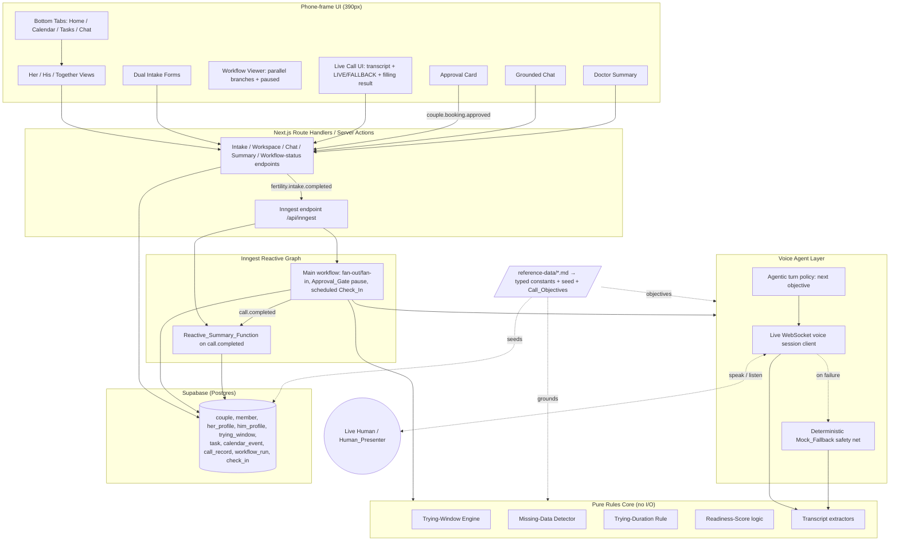
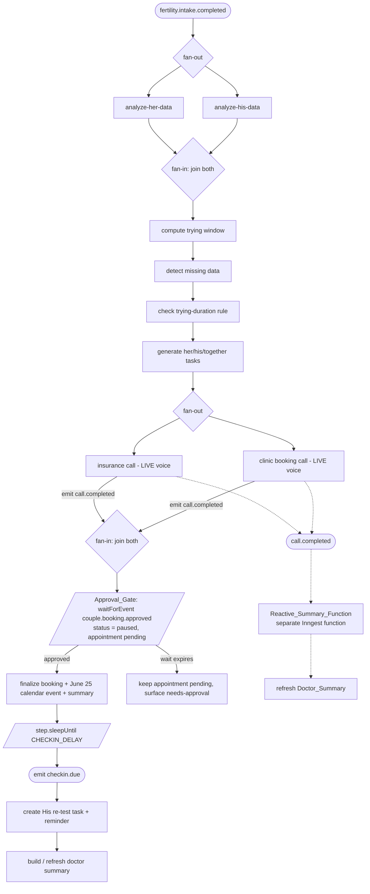
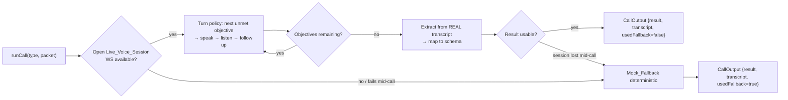
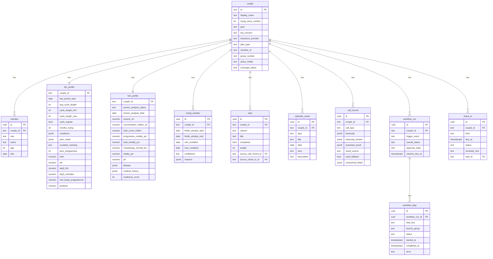

# Design Document

## Overview

Fairy is a mobile-first web application that treats fertility preparation as a shared, two-partner workflow for straight couples in the US trying to conceive. Beyond a tracker, it adds an autonomous agent that handles the phone-and-paperwork grind: it conducts **genuinely agentic, real-time spoken phone calls** with a live human (insurance representative and clinic scheduler), extracts structured results from the real live transcript, and turns them into calendar events and tasks. The product theme is **patient agency**.

This design realizes all 19 requirements with an architecture built for a one-day hackathon by two people working in parallel: a clean separation between a **pure rules core** (deterministic, heavily testable) and an **orchestration + UI shell** (Inngest, Grok, Grok Voice, Supabase, Next.js). The pure core — the Trying-Window engine, Missing-Data detector, Readiness-Score logic, Trying-Duration rule, and the structured-result extractors — is where correctness lives and where property-based testing pays off. Everything clinical is grounded in `/reference-data/`; nothing medical is invented.

Two architectural shifts define this revision:

1. **Live agentic voice, not a scripted responder.** The Voice_Agent runs a real `Live_Voice_Session` over a WebSocket (configured by `XAI_VOICE_WS_URL` / `XAI_VOICE_MODEL`), speaking its own questions aloud and listening to a live human (the Human_Presenter). The `call-scripts.md` content is a checklist of **Call_Objectives** (10 insurance / 7 clinic), not a verbatim script. The structured result is parsed from the **real** transcript. The deterministic `Mock_Fallback` is a **safety net only**, engaged when the live session is unavailable or fails mid-call.
2. **An event-driven reactive Inngest graph, not a linear sequence.** Analysis steps and phone calls fan out into parallel branches and join; the workflow pauses for a human-in-the-loop booking approval (`waitForEvent`); it schedules a delayed male-track check-in (`step.sleep`); and a separate function reacts to `call.completed` to refresh the doctor summary.

### Design Principles

1. **Reference data is the source of truth** (Req 12). Every clinical value, range, code, term, and Call_Objective traces to a `/reference-data/` file. The seed couple "Maya & Daniel" (`sample-couple.md`) is the only couple in the system. We encode reference values as typed constants and seed fixtures, never as free-floating literals scattered through UI code. `insurance-coverage-data.md` and `clinic-intake-data.md` are the Human_Presenter's cue sheet during the live call — read by the human, not a bot script.
2. **Pure core, impure shell.** The fertility math, detectors, scoring, and extraction are pure functions with no I/O. They are imported identically by the Inngest workflow (server) and, where useful, by the UI. The extractors parse a transcript — whether that transcript comes from the live human conversation or from the Mock_Fallback — so the same pure code maps spoken answers to the `call-scripts.md` schemas.
3. **Live-first, deterministic safety net for the demo** (Req 6.12, 6.13, 16.3). The primary path is the real Live_Voice_Session. Only when it is unavailable or fails mid-call does the deterministic `Mock_Fallback` engage; it returns identical schema and values for identical inputs, sets a `usedFallback` flag, and keeps the sub-three-minute demo from ever stalling. When the live session succeeds, the result comes from the real conversation, never from the fallback.
4. **Impeccable everywhere** (Req 13). All UI is produced through the Impeccable skill at `.kiro/skills/impeccable/`, presented as a 390px phone app with bottom tab navigation (Home, Calendar, Tasks, Chat), app-like cards, and sticky headers. A `critique.md` pass gates every screen. No generic Tailwind fallback.
5. **Calm, not cluttered** (Req 14). Exactly one footer disclaimer line; no synthetic-data badges or warnings in main views.

### Technology Stack (Req 15)

| Concern | Choice |
| --- | --- |
| Framework | Next.js (App Router), TypeScript |
| Styling / components | Tailwind CSS, shadcn/ui, governed by the Impeccable skill |
| Reasoning | xAI Grok (chat/structured reasoning, agentic turn policy) |
| Live calls | Grok Voice Agent API over WebSocket (`XAI_VOICE_WS_URL`, `XAI_VOICE_MODEL`); deterministic `Mock_Fallback` safety net |
| Orchestration | Inngest (event-driven reactive graph: parallel fan-out/fan-in, `waitForEvent` pause, `step.sleep` delay) |
| Data | Supabase (Postgres) |
| Deployment | Vercel; runs locally |
| Secrets / config | `XAI_API_KEY` from `.env.local`, falling back to `GROK_API_KEY`; `XAI_VOICE_WS_URL`, `XAI_VOICE_MODEL`, `CHECKIN_DELAY` |
| Excluded | Twilio, real telephony, real PHI |

## Architecture

### High-Level Architecture

Fairy is a single Next.js application. The browser renders the phone-frame UI and talks to the app's own route handlers. Route handlers read/write Supabase and emit/consume Inngest events. The Inngest reactive graph drives the agent and the pure rules core. The Voice_Agent opens a live WebSocket voice session to a live human; Grok and Grok Voice sit behind seams that fall through to a Mock_Fallback only on failure. A separate reactive function refreshes the doctor summary on `call.completed`.



### Workflow Events (Req 19.1)

The reactive graph is driven by four named events, all defined and used by the system:

| Event | Emitted by | Consumed by | Purpose |
| --- | --- | --- | --- |
| `fertility.intake.completed` | Intake route handler (Req 2.6) | Main Inngest_Workflow | Start the reactive graph (exactly once) |
| `call.completed` | Main workflow, per finished call (Req 7.10) | Reactive_Summary_Function | Refresh the doctor summary reactively |
| `couple.booking.approved` | Approval card UI (Req 17.3) | Main workflow (resumes `waitForEvent`) | Release the Approval_Gate pause |
| `checkin.due` | Main workflow on scheduled wake (Req 18.3) | Main workflow (same run) | Create the His re-test task + reminder |

### The Inngest Reactive Graph (Req 7, 17, 18, 19)

The workflow is the spine of the demo. It is triggered exactly once by `fertility.intake.completed` (Req 2.6) and runs as an **event-driven reactive graph**, not a linear sequence. Two branch-pairs fan out and join, the run pauses for human approval, and a scheduled delay drives the male-track check-in. Each step persists a status (`pending | running | completed | failed | paused`) that the Workflow_Viewer renders, including concurrent branches and the paused state (Req 7.5, 19.4).



```mermaid
sequenceDiagram
    participant UI as Intake / Call UI
    participant Ing as Main Workflow
    participant Core as Rules Core
    participant Agent as Voice Agent
    participant Human as Live Human
    participant RS as Reactive_Summary_Function
    participant DB as Supabase

    UI->>Ing: emit fertility.intake.completed (once)
    par Parallel analysis (fan-out)
        Ing->>Core: analyze-her-data
    and
        Ing->>Core: analyze-his-data
    end
    Note over Ing: join both branches (fan-in)
    Ing->>Core: compute trying window
    Ing->>Core: detect missing data
    Ing->>Core: check trying-duration rule
    Ing->>Core: generate her/his/together tasks
    par Parallel calls (fan-out)
        Ing->>Agent: insurance call (Live_Voice_Session)
        Agent->>Human: speak questions / listen (live)
        Agent-->>Ing: insurance result (live or fallback)
        Ing-->>RS: emit call.completed
    and
        Ing->>Agent: clinic booking call (Live_Voice_Session)
        Agent->>Human: speak questions / listen (live)
        Agent-->>Ing: clinic result (live or fallback)
        Ing-->>RS: emit call.completed
    end
    RS->>Core: refresh grounded Doctor_Summary
    Note over Ing: join both calls (fan-in)
    Ing->>Ing: waitForEvent couple.booking.approved (PAUSED; appointment pending)
    UI-->>Ing: couple.booking.approved
    Ing->>DB: finalize booking + 2026-06-25 event (idempotent)
    Ing->>Ing: step.sleepUntil(CHECKIN_DELAY)
    Ing-->>Ing: emit checkin.due
    Ing->>Core: create His re-test task + reminder
    Ing->>Core: build / refresh doctor summary
```

**Parallelism implementation (Req 7.2, 7.3).** Each fan-out runs its two branches as two `step.run` calls awaited together with `Promise.all([stepA, stepB])`. The `await` on the combined promise is the fan-in: the workflow does not proceed past the join until both branches resolve. This applies to the `analyze-her` / `analyze-his` pair and the `insurance call` / `clinic call` pair. Each branch persists its own step status, so both can be `running` simultaneously.

**Step status and failure (Req 7.5, 7.6).** Status is one of `pending | running | completed | failed | paused`. A thrown error in a step marks it `failed`, halts the steps that depend on it, and surfaces an error in the Workflow_Viewer naming the failed step. The Approval_Gate step is the only one that reports `paused`.

**Approval_Gate pause (Req 17).** After both calls join, the workflow calls Inngest `waitForEvent('couple.booking.approved', { timeout: APPROVAL_WAIT_TIMEOUT })` with a configurable, demo-short timeout (Req 17.6). While paused, the step status is `paused` and the appointment is reported `pending` (Req 17.4, 8.6). On `couple.booking.approved`, the **same run** resumes and finalizes the booking, the June 25 calendar event, and the summary (Req 17.3); finalize is idempotent so a repeated/duplicate event never double-books. If the wait expires before the event arrives, the appointment stays `pending` and the system surfaces a "needs approval" state (Req 17.5).

**Scheduled Check-In (Req 18).** After finalize, the workflow calls `step.sleepUntil` (or `step.sleep`) for the duration configured by `CHECKIN_DELAY` (demo seconds; UI copy represents the ~72-day / ~10–12-week sperm-regeneration horizon from `semen-analysis-reference.md`). On wake it emits `checkin.due`; handling that event creates the His-column "re-test semen analysis / review lifestyle progress" task plus a reminder (Req 18.3, 18.4, 5.7).

**Reactive summary (Req 19).** A separate Inngest function, `Reactive_Summary_Function`, listens for `call.completed` and refreshes the grounded Doctor_Summary using that call's extracted result, decoupled from the main run (Req 19.2, 19.3). It grounds every clinical statement only in Reference_Data and omits anything absent (Req 19.5).

### Voice Agent Strategy — Live Agentic Calls (Req 6, 15.2)

The agent layer exposes one interface (`runInsuranceCall`, `runClinicCall`). Internally it runs a **real** Live_Voice_Session: it opens a WebSocket to the Grok Voice endpoint (`XAI_VOICE_WS_URL` / `XAI_VOICE_MODEL`), and an **agentic turn policy** decides the next question from the remaining Call_Objectives plus context (couple data + missing-data flags). The agent speaks each question in its own words, listens to the live human's spoken answer, skips objectives already answered, and asks deeper follow-ups when an answer is vague (Req 6.2, 6.3). When the call ends, the extractors parse the **real live transcript** and map the parsed values to the `call-scripts.md` insurance/clinic schema (Req 6.4–6.7). The `Mock_Fallback` engages **only** when the live session is unavailable or fails mid-call (no mic, dropped WebSocket, bad network); it is deterministic and sets `usedFallback = true` (Req 6.12, 6.13).



**Guardrails (Req 6.10, 6.11).** The agent withholds member_id and DOB until the human asks to verify identity, then discloses them. It declines any request to make a medical decision or accept treatment, converting it to a follow-up task. These guardrails apply to the live transcript turns.

**Cue sheet vs. objectives.** `call-scripts.md` defines the Call_Objectives and the result schemas the agent must fill. `insurance-coverage-data.md` and `clinic-intake-data.md` are the Human_Presenter's cue sheet (deductible $1,500, in-network lab "Crest Diagnostics", June 25 slot, etc.) — read by the human during the live call, not executed as a bot script.

### Module / Directory Layout

```
app/
  (tabs)/
    home/        # Her / His / Together views + workflow viewer
    calendar/    # Shared calendar
    tasks/       # Task delegation board
    chat/        # Grounded chat
  intake/        # Dual intake forms (her / him / together)
  summary/       # Doctor-ready summary
  call/          # Live call UI (transcript, LIVE/FALLBACK, filling result)
  api/
    inngest/        # Inngest serve endpoint (main workflow + reactive summary fn)
    intake/         # emits fertility.intake.completed
    chat/           # Grounded chat endpoint (Grok + Mock_Fallback)
    summary/        # Summary build endpoint
    workflow-status/# per-step status incl. paused for the Workflow_Viewer
    workspace/      # scoped Her/His/Together data
    booking/        # emits couple.booking.approved (approval card)
lib/
  core/          # PURE: trying-window, missing-data, duration, score, extract
  reference/     # Typed constants derived from /reference-data/ (limits, ranges, Call_Objectives, cue values)
  agent/         # live.ts (WS voice session), turn-policy, extractors glue, mock-fallback
  inngest/       # client + main reactive workflow + reactive summary function + events
  db/            # Supabase client, queries, seed
  validation/    # Zod schemas for intake fields (ranges from reference)
components/
  ui/            # shadcn/ui primitives (Impeccable-styled)
  fairy/         # PhoneFrame, BottomTabs, StickyHeader, cards, CallUI, ApprovalCard, WorkflowViewer
supabase/
  migrations/    # schema (incl. workflow_run, check_in)
  seed/          # Maya & Daniel seed from sample-couple.md
```

## Components and Interfaces

### Reference Constants Layer (`lib/reference/`) — Req 12

A typed, single-source module that encodes the reference data so no clinical literal lives elsewhere. Examples grounded directly in the reference files:

```ts
// WHO 2021 lower reference limits — semen-analysis-reference.md
export const WHO_2021 = {
  semenVolumeMl: 1.4,
  concentrationMillionMl: 16,
  totalSpermMillion: 39,
  totalMotilityPct: 42,
  progressiveMotilityPct: 30,
  vitalityPct: 54,
  normalMorphologyPct: 4,
  phMin: 7.2,
} as const;

// female-hormone-reference.md (day-3 windows, mid-luteal progesterone target)
export const FEMALE_HORMONE = {
  day3FshDrawWindow: "cycle day 2–3",
  ovulationIndicativeProgesteroneNgMl: 10,
} as const;

// cycle-fertility-reference.md
export const DURATION_RULE = { under35Months: 12, atLeast35Months: 6, ageThreshold: 35 } as const;

// semen-analysis-reference.md — sperm regeneration horizon (drives Check_In copy)
export const SPERM_REGENERATION = { days: 72, displayWeeksMin: 10, displayWeeksMax: 12 } as const;

// CPT codes referenced by the agent and summary — cpt-codes-fertility.md
export const CPT = { semenAnalysis: "89320", fsh: "83001", estradiol: "82670",
  progesterone: "84144", tsh: "84443", prolactin: "84146", iui: "58322", ivf: "58970" } as const;

// Call_Objectives (NOT a verbatim script) — call-scripts.md
export const CALL_OBJECTIVES = {
  insurance: [/* 10 objectives to satisfy */],
  clinic: [/* 7 objectives to satisfy */],
} as const;
```

The seed couple, Call_Objectives, cue-sheet values, and clinic slots are encoded as typed constants/fixtures sourced verbatim from `sample-couple.md`, `call-scripts.md`, `insurance-coverage-data.md`, and `clinic-intake-data.md`.

### Trying-Window Engine (`lib/core/trying-window.ts`) — Req 3

Pure function implementing the irregular-cycle algorithm from `cycle-fertility-reference.md`. Uses only the female partner's inputs (Req 3.6); male data is not in the signature at all.

```ts
interface TryingWindowInput {
  lastPeriodStart: string;   // ISO date
  cycleLengthMin: number;    // days
  cycleLengthMax: number;    // days
  ovulationConfirmed: boolean; // mid-luteal progesterone OR LH confirmation present
}
interface TryingWindowOutput {
  fertileWindowStart: string; // ISO date
  fertileWindowEnd: string;
  minOvulation: string;       // priority day start
  maxOvulation: string;       // priority day end
  confidence: "Low" | "Moderate" | "High";
  reasons: string[];          // e.g. ["irregular cycle","ovulation not confirmed","wide cycle range"]
}
function computeTryingWindow(input: TryingWindowInput): TryingWindowOutput
```

Math (all date arithmetic in days):
- `minOvulation = lastPeriodStart + cycleLengthMin − 14`
- `maxOvulation = lastPeriodStart + cycleLengthMax − 14`
- `fertileWindowStart = minOvulation − 5`
- `fertileWindowEnd = maxOvulation + 1`

Confidence is `Low` with reasons `["irregular cycle","ovulation not confirmed","wide cycle range"]` when ovulation is unconfirmed AND `cycleLengthMax − cycleLengthMin > 7` (Req 3.5). For the seed couple (`2026-06-01`, 45, 60) this yields fertile window **Jun 27 – Jul 18, 2026**, priority **Jul 2 – Jul 17, 2026**, confidence **Low** (Req 3.2–3.4). Missing/invalid required input throws a typed error and preserves prior state (Req 3.7).

### Missing-Data Detector (`lib/core/missing-data.ts`) — Req 4

Pure function over female labs, semen results, and coverage status. Produces a consolidated checklist of flagged items with grounded explanations.

```ts
type FlagKind = "missing" | "borderline" | "unverified";
interface DataFlag {
  id: string;            // e.g. "day3_fsh", "concentration", "insurance_coverage"
  kind: FlagKind;
  label: string;
  explanation: string;   // grounded text citing the reference file
  source: string;        // reference file name
}
function detectMissingData(input: MissingDataInput): DataFlag[]
```

Rules (all grounded):
- `day3_fsh` / `day3_estradiol` null → `missing`, explanation: drawn on cycle day 2–3 for ovarian-reserve assessment (`female-hormone-reference.md`) (Req 4.2).
- `mid_luteal_progesterone` null → `missing`, ovulation can't be confirmed without a mid-luteal progesterone rise toward ≈10 ng/mL (Req 4.3).
- `prolactin` null → `missing`, part of the pituitary/ovulation screen (Req 4.4).
- Any semen parameter below its WHO 2021 limit → `borderline`, recommend one repeat analysis after 2–7 days abstinence (Req 4.5).
- `coverage_status != "confirmed"` → `unverified`, verification required before care (Req 4.6).

The detector returns a consolidated checklist of every flagged item with its explanation (Req 4.1, 4.7).

### Trying-Duration Rule (`lib/core/duration-rule.ts`) — Req 7.7–7.9

```ts
interface DurationInput { femaleAge: number; monthsTrying: number; redFlags: string[]; }
interface DurationResult { thresholdMonths: 6 | 12; recommendEarlyEvaluation: boolean; redFlags: string[]; }
```

`femaleAge < 35 → 12`, else `6` (Req 7.7). Any red flag (irregular/absent periods, known PCOS/endometriosis, prior pelvic surgery, known male factor) forces early-evaluation regardless of threshold (Req 7.8). Seed couple: age 33 → 12-month threshold, 8 months trying, early evaluation due to irregular cycles + borderline semen analysis (Req 7.9).

### Readiness-Score Logic (`lib/core/readiness.ts`) — Req 1.4, 5.4

```ts
function applyTaskCompletion(score: number, taskWeight: number): number // clamps to [0,100]
```

Completing a male-track task increases the score; the result is always an integer clamped to `[0,100]` inclusive. Seed starting value 62 (`sample-couple.md`).

### Structured-Result Extractors (`lib/core/extract.ts`) — Req 6.4–6.8

Two pure extractors map a **transcript** (the real live human conversation, or the Mock_Fallback transcript) to the exact schemas in `call-scripts.md`. They parse spoken answers regardless of order or wording, which is why they are the seam shared by both the live and fallback paths.

```ts
interface InsuranceResult {
  diagnostic_covered: boolean; semen_analysis_covered: boolean; hormone_labs_covered: boolean;
  prior_auth_required_for: string[]; in_network_lab: string; deductible: number;
  coinsurance_pct: number; oop_max: number; referral_required: boolean; follow_up_tasks: string[];
}
interface ClinicResult {
  booked: { date: string; time: string; mode: string; clinic: string };
  bring_list: string[];
  tasks: { her: string[]; him: string[]; together: string[] };
  calendar_event: { type: string; date: string; time: string };
}

// Parse a chronological transcript of agent/human turns into the schema.
function extractInsurance(transcript: Turn[]): Extraction<InsuranceResult>;
function extractClinic(transcript: Turn[]): Extraction<ClinicResult>;
```

Any field that cannot be extracted is marked unresolved, a follow-up task is added, and all other fields are preserved (Req 6.8). A request for a medical decision is declined and converted to a follow-up task (Req 6.11). Member ID / DOB are withheld until the human requests identity verification (Req 6.10).

### Voice Agent — Live Session, Turn Policy, Fallback (`lib/agent/`) — Req 6, 15.2

```ts
interface Turn { role: "agent" | "human"; text: string; at: number; partial?: boolean; }

// Live WebSocket voice session client — the real seam (lib/agent/live.ts).
interface LiveVoiceSession {
  connect(): Promise<void>;                 // open XAI_VOICE_WS_URL with XAI_VOICE_MODEL
  speak(prompt: string): Promise<void>;     // send a TTS prompt (agent's own phrasing)
  onHumanTurn(cb: (turn: Turn) => void): void; // receive transcribed human turns
  partialTranscript(): Turn[];              // stream partial transcript to the UI
  close(): Promise<void>;
}

// Agentic turn policy — decides the next question from remaining objectives + context.
function nextQuestion(
  objectives: CallObjective[],
  answered: Set<string>,
  context: { couple: CoupleData; flags: DataFlag[]; lastAnswer?: Turn }
): { objectiveId: string; phrasing: string } | null; // null when all objectives satisfied

interface CallOutput<T> {
  transcript: Turn[];            // chronological agent/human turns (full)
  transcriptStream: Turn[];      // partial turns as they appeared live (UI)
  result: T;
  unresolvedFields: string[];
  usedFallback: boolean;         // true only when the live session was unavailable/failed
}

function runInsuranceCall(packet: AuthPacket): Promise<CallOutput<InsuranceResult>>;
function runClinicCall(packet: AuthPacket): Promise<CallOutput<ClinicResult>>;
```

`runInsuranceCall` / `runClinicCall` open a `LiveVoiceSession`, then loop: `nextQuestion` picks the next unmet objective, the agent `speak`s it, the human answers live, `onHumanTurn` appends the answer, and the loop repeats until all objectives are satisfied (skipping already-answered objectives, asking deeper follow-ups on vague answers — Req 6.2, 6.3). On a clean end, the extractor parses the **real** transcript (Req 6.4–6.7). If `connect`/`speak`/`onHumanTurn` fails or the session is unavailable, the call switches to the deterministic `Mock_Fallback` and sets `usedFallback = true` (Req 6.12, 6.13). On clinic completion the agent writes back her/his/together tasks, a `2026-06-25` calendar event, and a coverage+appointment+bring-list summary (Req 6.9).

### UI Components (`components/fairy/`) — Req 1, 13, 14

All built via the Impeccable skill, each gated by a `critique.md` pass. `PhoneFrame` enforces the 390px mobile frame; `BottomTabs` provides Home / Calendar / Tasks / Chat; `StickyHeader` per screen; app-like cards used only where they are the best affordance. A single `DisclaimerFooter` renders exactly one line (Req 14).

- **WorkspaceTabs**: Her / His / Together segmented control; each view loads its scoped data within the required latency budgets (Req 1.3–1.5). `MISSING` values render as missing-data flags, never blanks or substitutes (Req 1.8).
- **IntakeForm**: structured fields only (Req 2.1), Zod-validated against reference ranges; invalid entries are rejected, prior value retained, error names the field + expected range (Req 2.8).
- **WorkflowViewer**: renders the reactive graph with `pending/running/completed/failed/paused` chips. It shows the two parallel branch-pairs running **simultaneously** (analyze-her/analyze-his and insurance-call/clinic-call) as side-by-side concurrent lanes, the paused Approval_Gate state, and the scheduled Check_In sleep (Req 7.4, 7.5, 19.4). Concurrency is rendered by reading per-step rows from `workflow_run` and drawing branches sharing a fan-out node as parallel lanes until their shared fan-in node.
- **CallUI** (`app/call/`): shows the live transcript as agent/human turns appear, a **LIVE-vs-FALLBACK indicator** reflecting `usedFallback`, and the structured-result fields filling in as they are extracted (Req 6.14).
- **ApprovalCard**: shown while the workflow is paused; states the agent verified coverage and found a June 25 slot and asks the couple to approve. Selecting Approve calls the booking endpoint, which emits `couple.booking.approved` (Req 17.2, 17.3).
- **TaskBoard**: three columns Her / His / Together (Req 5.1); creates tasks from extracted results (Req 5.2), and renders the His re-test task when the Check_In fires (Req 5.7).
- **CalendarView**: window, priority days, reminders, consult, tasks (Req 10).
- **DoctorSummary**: sectioned, single copy-to-clipboard action (Req 8.2); appointment shows `pending` until approval (Req 8.6).
- **GroundedChat**: fixed five-section answer format (Req 9.2).

### Grounded Chat (`app/api/chat/`) — Req 9

Answers are constrained to the single seed couple `couple_001`. The endpoint builds a Grok prompt from the couple's persisted data + reference sources and enforces the fixed output order: **Short answer → Based on your data → What's uncertain → Shared next step → Sources**, every section present and non-empty (Req 9.2). If a requested fact is absent from Reference_Data, the answer states it is unavailable and offers no substitute (Req 9.4). A Mock_Fallback supplies deterministic structured answers for the five canonical questions when Grok is unavailable.

### Doctor Summary + Reactive_Summary_Function (`app/api/summary/`, `lib/inngest/`) — Req 8, 19

The summary builder assembles both partners' data, the Trying-Window output, Missing-Data flags, doctor questions, verified coverage facts, and the June 25 consult. Clinical statements are restricted to Reference_Data sources; anything not present is omitted (Req 8.3–8.4). Coverage is labeled `unverified` while `coverage_status = partial_unconfirmed` (Req 8.5); appointment shows `pending` while the Approval_Gate is unresolved (Req 8.6).

The **Reactive_Summary_Function** is a separate Inngest function (decoupled from the main workflow) that listens for `call.completed` and re-runs the same grounded builder with the new extracted result, so the summary refreshes reactively as each call finishes (Req 19.2, 19.3, 19.5).

## Data Models

### Supabase Schema (Req 11)

The eight required entities are preserved; this revision **adds fields and entities additively** for the live call, the reactive workflow, and the scheduled check-in. Clinical values are stored exactly as defined in Reference_Data; `null` represents `MISSING` so the detector and UI can flag it.



**Additive fields and entities:**
- `call_record` gains `transcript_stream` (the partial live turns shown in the Call UI), `result_source` (`"live" | "fallback"`), and keeps `used_fallback` as the LIVE-vs-FALLBACK indicator (Req 6.14).
- `workflow_run` + `workflow_step` capture the reactive graph: per-step `status` of `pending | running | completed | failed | paused`, a `branch_group` so the Workflow_Viewer can draw concurrent lanes, an `approval_state` (`awaiting | approved | expired`) for the Approval_Gate, and `checkin_due_at` for the scheduled sleep (Req 7.5, 17.5, 19.4).
- `check_in` represents the scheduled male-track Check_In and its reminder; when due it produces the His re-test task (Req 18.4, 5.7).

### Seed Data (Req 11.2–11.3)

The seed loader writes Maya & Daniel exactly as in `sample-couple.md`: couple `couple_001`, `coverage_status: partial_unconfirmed`; Maya age 33, `last_period_start 2026-06-01`, cycle 45–60, `cycle_regular false`, 8 months trying, suspected PCOS, letrozole history, labs with `day3_fsh / day3_estradiol / mid_luteal_progesterone / prolactin = null` (MISSING) and `amh 1.6`, `tsh 2.1`; Daniel age 35, semen completed `2026-05-20` with concentration 14, total count 29, progressive motility 28, morphology 3 (all below WHO), lifestyle heat exposure true / stress high / BMI 27, readiness 62. If seed data is missing or unparseable, the workspace refuses to render partially and shows a load error (Req 1.7).

### Validation Schemas (`lib/validation/`) — Req 2

Zod schemas enforce reference-grounded bounds: Her `avg_cycle_length` within stated range, enumerations for `semen_analysis_status` (`not_started | in_progress | completed`), `policy_holder` (`her | him`), `coverage_known` (`confirmed | partial_unconfirmed | unconfirmed`), and semen values validated against WHO 2021 limits. Field names mirror `sample-couple.md` exactly (Req 2.5). On both intakes valid, the system emits `fertility.intake.completed` exactly once (Req 2.6).

### Configuration and Secrets (Req 15.4, 15.5)

| Key | Purpose |
| --- | --- |
| `XAI_API_KEY` → `GROK_API_KEY` (fallback) | Grok reasoning / chat key resolution |
| `XAI_VOICE_WS_URL` | Live_Voice_Session WebSocket endpoint |
| `XAI_VOICE_MODEL` | Grok Voice model for the live session |
| `CHECKIN_DELAY` | Scheduled Check_In delay (e.g. `"10s"` for demo; represents ~72-day / ~10–12-week horizon) |
| `APPROVAL_WAIT_TIMEOUT` | Configurable demo-short Approval_Gate `waitForEvent` timeout (Req 17.6) |

If neither Grok key is present, reasoning paths run on Mock_Fallback; if the voice WS config is absent or fails, the call runs on the deterministic Mock_Fallback. Secret values are never echoed in logs or UI.

## Correctness Properties

*A property is a characteristic or behavior that should hold true across all valid executions of a system — essentially, a formal statement about what the system should do. Properties serve as the bridge between human-readable specifications and machine-verifiable correctness guarantees.*

These properties target the pure rules core, the transcript extractors and agent guardrails, the workflow orchestration logic, and the grounding logic, where behavior varies meaningfully with input and many generated cases reveal edge bugs. UI structure, latency budgets, the live WebSocket audio path, deployment/config, and design-process requirements are validated by example, integration, and smoke tests instead (see Testing Strategy). After the initial analysis, redundant properties were consolidated (e.g. the old "live result conforms to schema" and "any-order parsing" checks combine into a single comprehensive call-output property plus a distinct any-order/wording property; the old verbatim-scripted-playback property is removed because the live result now comes from the real conversation).

### Property 1: Trying-window algebraic relationships

*For any* valid female input (`lastPeriodStart`, `cycleLengthMin ≤ cycleLengthMax`), the engine output satisfies `minOvulation = lastPeriodStart + cycleLengthMin − 14`, `maxOvulation = lastPeriodStart + cycleLengthMax − 14`, `fertileWindowStart = minOvulation − 5`, and `fertileWindowEnd = maxOvulation + 1`, as calendar dates.

**Validates: Requirements 3.1**

### Property 2: Low-confidence reasons when unconfirmed and wide

*For any* input where ovulation is not confirmed AND `cycleLengthMax − cycleLengthMin > 7`, the engine outputs confidence exactly `"Low"` and reasons exactly `["irregular cycle", "ovulation not confirmed", "wide cycle range"]`.

**Validates: Requirements 3.4, 3.5**

### Property 3: Ovulation timing ignores male data

*For any* fixed female input and *any* male partner data, the trying-window output is identical regardless of the male data (male data never changes ovulation timing).

**Validates: Requirements 3.6**

### Property 4: Trying-window rejects invalid required input

*For any* input missing or invalidating a required field (`lastPeriodStart`, `cycleLengthMin`, `cycleLengthMax`), the engine raises a typed error and the prior state is preserved.

**Validates: Requirements 3.7**

### Property 5: Missing labs are flagged with grounded explanations

*For any* female lab set, each of `day3_fsh`, `day3_estradiol`, `mid_luteal_progesterone`, and `prolactin` is flagged `missing` with a non-empty grounded explanation if and only if its value is null.

**Validates: Requirements 4.2, 4.3, 4.4**

### Property 6: Semen parameters flagged borderline iff below WHO 2021 limit

*For any* semen analysis result, each parameter is flagged `borderline` (with a repeat-analysis-after-2–7-days-abstinence recommendation) if and only if its value is below its WHO 2021 lower reference limit.

**Validates: Requirements 4.5**

### Property 7: Insurance flagged unverified iff not confirmed

*For any* coverage status value, insurance coverage is flagged `unverified` if and only if the status is not equal to `"confirmed"`.

**Validates: Requirements 4.6**

### Property 8: Checklist completeness

*For any* detector input, the consolidated checklist contains exactly the set of flags produced by the rules — every flagged missing item and every flagged borderline item appears exactly once, each with a non-empty explanation, and no unflagged item appears.

**Validates: Requirements 4.1, 4.7**

### Property 9: Readiness score stays an integer within [0, 100]

*For any* starting score in [0, 100] and *any* sequence of male-track task completions with arbitrary weights, the resulting Readiness_Score is an integer, never decreases on a completion, and remains within [0, 100] inclusive.

**Validates: Requirements 1.4, 5.4**

### Property 10: Every task is assigned to exactly one column

*For any* extracted call result, each follow-up task created is assigned to exactly one of the columns Her, His, or Together (never zero, never more than one).

**Validates: Requirements 5.2, 5.5**

### Property 11: Intake validation rejects out-of-range values

*For any* clinical field with a reference range and *any* value outside that range, the intake rejects the value, retains the prior value, and produces an error that names the field and its expected range; *for any* in-range value, the intake accepts it.

**Validates: Requirements 2.7, 2.8**

### Property 12: Intake completion event fires exactly once

*For any* sequence of intake updates, `fertility.intake.completed` is emitted exactly once and only after both partners' intakes are complete and valid (never before, never twice).

**Validates: Requirements 2.6**

### Property 13: Duration threshold by age

*For any* female age, the trying-duration threshold is 12 months if age < 35 and 6 months if age ≥ 35.

**Validates: Requirements 7.7**

### Property 14: Red flags force early evaluation

*For any* duration input containing at least one red-flag condition, early evaluation is recommended regardless of months trying or the age-based threshold.

**Validates: Requirements 7.8**

### Property 15: Call output conforms to its schema

*For any* completed call (live or Mock_Fallback) and *any* responder variation, the output contains a chronological agent/human transcript and an extracted result conforming to that call type's schema (insurance or clinic, as defined in `call-scripts.md`).

**Validates: Requirements 6.7**

### Property 16: Live result is parsed from the human transcript regardless of order or wording

*For any* live transcript that answers the Call_Objectives — with the answers given in any order and in any phrasing — the extractor produces the same correct structured result, and an objective already answered earlier in the transcript is not treated as unanswered. The result is sourced from the actual human-spoken transcript.

**Validates: Requirements 6.3, 6.6**

### Property 17: Unresolved fields are isolated

*For any* set of fields that cannot be extracted from a call transcript, each such field is marked unresolved with a corresponding follow-up task, and every successfully extracted field is preserved unchanged.

**Validates: Requirements 6.8**

### Property 18: Identity details withheld until verification requested

*For any* call conversation, the member ID and date of birth are disclosed only after the human requests identity verification, and never before.

**Validates: Requirements 6.10**

### Property 19: Medical-decision requests are declined

*For any* human turn requesting a medical decision or acceptance of treatment, the agent declines and adds a follow-up task for the couple, and never accepts on their behalf.

**Validates: Requirements 6.11**

### Property 20: Mock_Fallback engages only on live failure and is deterministic

*For any* call, when the Live_Voice_Session succeeds the output has `usedFallback = false` and the result is sourced from the live transcript; the Mock_Fallback is engaged if and only if the live session is unavailable or fails mid-call, in which case `usedFallback = true`. *For any* call type and authorization packet, repeated Mock_Fallback runs with identical inputs return identical schema and identical field values.

**Validates: Requirements 6.12, 6.13**

### Property 21: Parallel branches both complete before the workflow proceeds past a fan-in

*For any* timing of the two branches in a fan-out pair (analyze-her/analyze-his, and insurance-call/clinic-call), the step following the fan-in does not start until both branches have completed.

**Validates: Requirements 7.2, 7.3**

### Property 22: Approval resume is idempotent and never double-books

*For any* number of `couple.booking.approved` deliveries to a paused run (one or more), the same run resumes and finalizes exactly one booking and exactly one June 25 calendar event (no double-booking).

**Validates: Requirements 17.3**

### Property 23: Appointment stays pending until approval or timeout

*For any* Approval_Gate outcome, the clinic appointment is reported `pending` while the run is paused awaiting approval; it remains `pending` (with a "needs approval" state) if the wait expires before approval; and it is finalized only after `couple.booking.approved` is received.

**Validates: Requirements 17.4, 17.5, 8.6**

### Property 24: Reactive summary fires on every call.completed

*For any* sequence of completed calls, the Reactive_Summary_Function refreshes the Doctor_Summary exactly once per `call.completed` event, and every refreshed summary is grounded only in Reference_Data (omitting any value not present in Reference_Data).

**Validates: Requirements 19.2, 19.3**

### Property 25: Persistence round-trip preserves values

*For any* profile, call record (including `transcript_stream` and `used_fallback`), workflow_run, or check_in object, serializing then deserializing (and writing then reading from the data layer) preserves all field values exactly, including null `MISSING` values.

**Validates: Requirements 11.3**

### Property 26: Summary and chat are grounded in Reference_Data

*For any* couple data, every clinical value and citation appearing in the doctor summary or a chat answer traces to a source within Reference_Data; any value absent from Reference_Data is omitted (summary) or reported as unavailable with no substitute (chat).

**Validates: Requirements 8.3, 8.4, 9.4, 12.1, 12.3**

### Property 27: Chat answers use the fixed five-section format

*For any* question, the grounded-chat answer contains the five sections — Short answer, Based on your data, What's uncertain, Shared next step, Sources — in that exact order, each present and non-empty.

**Validates: Requirements 9.2**

### Property 28: Chat is scoped to the seed couple

*For any* question, every source cited in the answer references the single seed couple `couple_001` / Reference_Data, and no other couple's data appears.

**Validates: Requirements 9.3**

### Property 29: MISSING values render as flags

*For any* profile with an arbitrary subset of fields set to `MISSING` (null), each such field renders as a missing-data flag, never as a blank field and never as a substituted value.

**Validates: Requirements 1.8**

### Property 30: Calendar dates equal engine output

*For any* Trying_Window_Engine output, the calendar's displayed trying-window and priority-day dates equal that output exactly, and after the engine updates, the displayed dates match the new output.

**Validates: Requirements 10.3, 10.4**

### Property 31: Single disclaimer, no synthetic-data clutter

*For any* rendered screen, exactly one disclaimer line with the exact text "Fairy provides educational fertility information, not medical advice." appears, and no synthetic-data badge or warning appears in the main views.

**Validates: Requirements 14.1, 14.2**

## Error Handling

The system distinguishes recoverable input/validation errors (handled inline in the UI, prior state preserved) from workflow/agent failures (surfaced in the Workflow_Viewer) and demo-continuity failures (handled by the Mock_Fallback safety net).

### Intake and Engine Input Errors
- **Out-of-range intake values** (Req 2.8): rejected at the Zod boundary; the field retains its prior value and an inline error names the field and its expected reference range. The form never persists an invalid value.
- **Missing/invalid trying-window inputs** (Req 3.7): the engine throws a typed `TryingWindowInputError`; the caller preserves prior state and the UI shows a non-destructive error on the window card.

### Seed and Data Errors
- **Missing/unparseable seed** (Req 1.7): the workspace loader validates the seed against its schema; on failure it renders a single "workspace cannot be loaded" error state and does not render any partial view.
- **MISSING clinical values** (Req 1.8): represented as `null` and always rendered as a missing-data flag, never blank or substituted.

### Workflow Errors (Req 7.6)
- Each Inngest step runs in `step.run`; a thrown error marks that step `failed`, halts the steps that depend on it, and surfaces an error in the Workflow_Viewer naming the failed step. Earlier completed steps' persisted outputs remain. Within a fan-out pair, if one branch fails, the fan-in does not proceed and the failed branch is identified.

### Agent and Live-Call Errors
- **Live_Voice_Session unavailable or fails mid-call** (Req 6.12, 6.13): on no microphone, a dropped WebSocket, or a bad network, the call switches to the deterministic Mock_Fallback, sets `usedFallback = true`, and still produces a valid, identical-on-repeat result so the call completes and the Approval_Gate can still resume (Req 16.3).
- **Unresolved fields** (Req 6.8): marked unresolved + follow-up task added; other fields preserved.
- **Extraction failure** (Req 5.6): no tasks created; a "result extraction failed" indication is shown.
- **Guardrails** (Req 6.10, 6.11): identity details withheld until the human requests verification; medical-decision requests declined and converted to tasks. These apply to the live transcript turns.

### Workflow Pause and Schedule
- **Approval_Gate expiry** (Req 17.5): if `waitForEvent` times out before `couple.booking.approved`, the appointment stays `pending` and the run surfaces a "needs approval" state rather than booking.
- **Duplicate approval** (Req 17.3): finalize is idempotent, so a repeated `couple.booking.approved` never double-books.
- **Scheduled Check_In** (Req 18): on wake, `checkin.due` creates the His re-test task + reminder; the demo-short `CHECKIN_DELAY` keeps this observable while UI copy shows the ~10–12-week horizon.

### Calendar and Chat Errors
- **Engine output unavailable on calendar open** (Req 10.5): show an error that window/priority dates cannot be loaded; retain any previously loaded calendar data.
- **Absent fact in chat** (Req 9.4): state the information is unavailable; never substitute a value.

### Secrets
- **Key resolution** (Req 15.4): read `XAI_API_KEY`, else `GROK_API_KEY`. If neither is present, reasoning paths run on Mock_Fallback; if the voice WS config (`XAI_VOICE_WS_URL` / `XAI_VOICE_MODEL`) is absent or fails, calls run on the deterministic Mock_Fallback. Secret values are never echoed in logs or UI.

## Testing Strategy

Fairy uses a dual approach: **property-based tests** for the pure rules core, transcript extractors, agent guardrails, workflow orchestration logic, and grounding logic (where input variation reveals bugs), and **example / integration / smoke tests** for UI structure, the live WebSocket path, workflow wiring, latency, configuration, and the demo path.

### Property-Based Testing

PBT applies to Fairy because its core is a set of pure functions (date math, rule-based detectors, scoring, transcript extraction, serialization) plus deterministic orchestration logic with clear universal properties.

- **Library**: `fast-check` with Vitest (TypeScript). Property-based testing is not implemented from scratch.
- **Iterations**: each property test runs a minimum of 100 generated cases.
- **Generators**: ISO dates, `cycleLengthMin ≤ cycleLengthMax` pairs, lab sets with random null subsets, semen results spanning above/below each WHO limit, coverage-status enums, ages around the 35 boundary, red-flag sets, **transcripts with Call_Objective answers in randomized order and varied wording**, transcripts with verification requests and medical-decision requests at varying turns, transcripts missing arbitrary fields, branch-completion timings for the fan-out pairs, sequences of `call.completed` events, sequences of `couple.booking.approved` deliveries, and profile/call_record/workflow_run/check_in objects for round-trips.
- **Tagging**: each property test references its design property using the format
  **Feature: fairy, Property {number}: {property_text}**
- Properties 1–31 above each map to a single property-based test.

**Live-voice testing note.** The live-voice properties (15, 16, 17, 18, 19, 20) are validated against **recorded/simulated transcript fixtures fed to the extractor** — the human turns are provided as transcript inputs, so the pure parsing/guardrail logic is exercised across many generated variations. The real WebSocket audio path (`lib/agent/live.ts`: connect / speak / listen) is **not** unit-tested with real audio; it is exercised by a thin integration seam (a mocked `LiveVoiceSession`) plus manual verification during the demo. Property 20's "engages only on failure" half is tested by driving that seam to succeed vs. fail and asserting the `usedFallback` flag and result source.

**Workflow orchestration testing note.** Properties 21–24 test our orchestration/reactor logic, not Inngest itself: a deterministic step harness with mocked `step.run` / `waitForEvent` / `step.sleep` records branch completions, approval deliveries, and emitted events, so the fan-in join, idempotent finalize, pending-until-approval state machine, and per-`call.completed` summary refresh are asserted across generated inputs.

### Example-Based Unit Tests
- Seed-couple worked examples: trying window Jun 27 – Jul 18, 2026; priority Jul 2 – Jul 17, 2026; confidence "Low" (Req 3.2–3.4); duration outcome 12-month threshold + early evaluation (Req 7.9).
- Intake field presence and structured-only inputs (Req 2.1–2.5).
- Agent satisfies the 10 insurance / 7 clinic Call_Objectives from a representative live-style transcript and clinic write-back of the Jun 25 event + tasks + summary (Req 6.2, 6.4, 6.5, 6.9).
- Summary sections, single-operation copy, coverage `unverified`, appointment `pending` (Req 8.1, 8.2, 8.5, 8.6).
- His-view track contents and three task columns (Req 5.1, 5.3); His re-test task on Check_In (Req 5.7).
- Key resolution across all env-var combinations (Req 15.4).

### Integration Tests
- The reactive Inngest graph with a mocked agent and a mocked `LiveVoiceSession`: assert the fan-out/fan-in for both branch-pairs (Req 7.1–7.4), status enum transitions including `paused` (Req 7.5, 19.4), failure halting (Req 7.6), the `waitForEvent` Approval_Gate pause/resume on `couple.booking.approved` (Req 17.1–17.3), `waitForEvent` timeout behavior (Req 17.5), and the `step.sleep`/`checkin.due` schedule (Req 18.1, 18.3, 18.4).
- The Reactive_Summary_Function reacting to `call.completed` independently of the main run (Req 19.1–19.3).
- The live call seam: open session, drive a few agent/human turns through the mocked WebSocket, render the Call UI transcript + LIVE/FALLBACK indicator + filling result (Req 6.1, 6.14) — 1–3 representative examples; real audio is verified manually.
- End-to-end demo path with the Mock_Fallback safety net: intake → reactive graph with visible parallel branches → window/missing data → calls → Approval_Gate pause/resume → tasks + Jun 25 consult → scheduled Check_In → Reactive_Summary → Doctor_Summary (Req 16.1, 16.3). Sub-three-minute timing verified manually during rehearsal (Req 16.2).

### Smoke / Configuration Tests
- Migrations define the eight required entities plus `workflow_run`/`workflow_step` and `check_in`, and the seed populates `couple_001` (Req 11.1, 11.2).
- Workflow_Events `fertility.intake.completed`, `call.completed`, `couple.booking.approved`, and `checkin.due` are defined and wired (Req 19.1).
- Stack and sponsor-tool checks; env config present for `XAI_VOICE_WS_URL`, `XAI_VOICE_MODEL`, `CHECKIN_DELAY`, `APPROVAL_WAIT_TIMEOUT`; README names xAI, Inngest, Vercel, Cursor and documents HIPAA/BAA deferral (Req 15.1, 15.5, 15.9, 15.10).

### Design-Process Gates (Impeccable)
- Every screen is built through the Impeccable skill (`.kiro/skills/impeccable/`) and must pass a `critique` review before being considered done (Req 13.1–13.3). The 390px frame and the four bottom tabs (Home, Calendar, Tasks, Chat) are asserted in a structural render test (Req 13.4). These are process gates, not property tests.

### Latency Expectations
Per-view (≤ 2s), calendar (≤ 3s), and chat (≤ 10s) budgets (Req 1.3–1.5, 10.1, 10.2, 9.2) are verified by manual observation during the demo rehearsal rather than automated timing, consistent with the hackathon scope.
